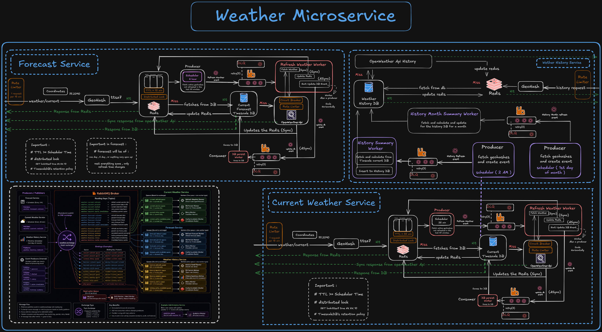
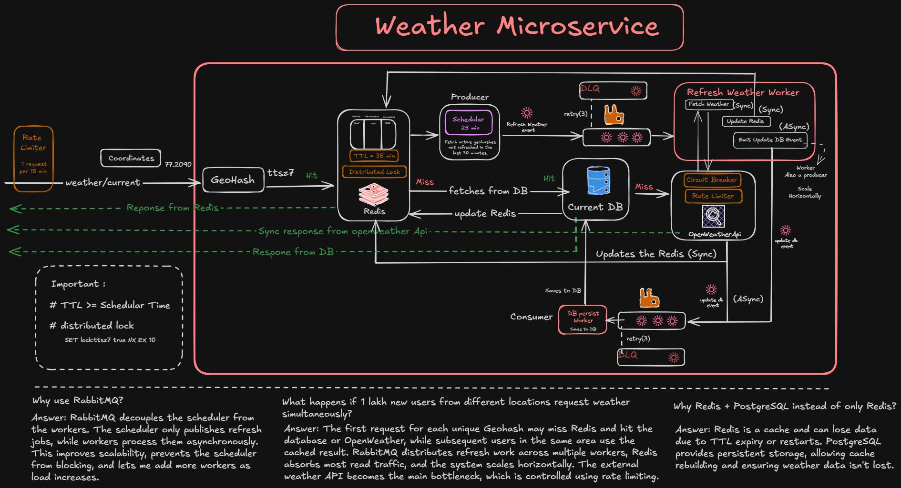

# 🌦️ KB Weather Service

A high-performance Weather Microservice powering **Kissan Bandhu**.

The service provides:

- 🌤 Current Weather
- 🌦 5-Day Weather Forecast
- 📈 Historical Weather
- 📅 Monthly Weather Summary

Built with **Spring Boot**, **Redis**, **PostgreSQL**, **RabbitMQ**, and the **OpenWeather API**, the service is designed using an event-driven architecture that minimizes external API calls while remaining horizontally scalable.

<p align="center">


<br>


<br>


</p>
---

# 🏗 Architecture

<h2 align="center">Complete Weather Service</h2>

<p align="center">
  
</p>

<h2 align="center">Current Weather Workflow</h2>

<p align="center">
  
</p>

---

# 📖 Overview

The Weather Service is designed to efficiently serve weather data while reducing latency and external API usage.

Instead of querying OpenWeather for every request, it follows a layered retrieval strategy:

```
Client
    │
    ▼
Redis Cache
    │
    ▼
PostgreSQL
    │
    ▼
OpenWeather API
```

Frequently requested locations are refreshed in the background using scheduled jobs and asynchronous workers, ensuring that most requests are served directly from Redis.

RabbitMQ decouples producers from consumers, allowing background processing to scale independently.

---

# ✨ Features

- Current Weather
- 5-Day Weather Forecast
- Weather History
- Monthly Summary Generation
- Redis Cache
- GeoHash-based location grouping
- Background Refresh Workers
- RabbitMQ Event-Driven Architecture
- Distributed Locking
- Circuit Breaker
- Rate Limiting
- Retry + Dead Letter Queue (DLQ)
- JWT Authentication
- Swagger / OpenAPI Documentation

---

# 🛠 Technology Stack

| Layer | Technology |
|--------|------------|
| Language | Java 21 |
| Framework | Spring Boot 3 |
| Database | PostgreSQL |
| Cache | Redis |
| Messaging | RabbitMQ |
| External API | OpenWeather API |
| Authentication | JWT |
| Migration | Flyway |
| Documentation | SpringDoc OpenAPI |
| Resilience | Resilience4j |

---

# 🚀 Setup

## Prerequisites

- Java 21
- Gradle 8+
- Docker & Docker Compose
- Git
- OpenWeather API Key
- GitHub Personal Access Token (`read:packages`) for `kb-common`

---

## Clone Repository

```bash
git clone https://github.com/<your-username>/kb-weather-service.git

cd kb-weather-service
```

---

## Generate Gradle Wrapper

```bash
gradle wrapper --gradle-version 8.10
```

---

## Configure Credentials

```bash
cp gradle.properties.example gradle.properties
cp .env.example .env
```

### gradle.properties

```properties
gpr.user=<github-username>
gpr.token=<github-token>
```

### .env

Configure:

- PostgreSQL
- Redis
- RabbitMQ
- JWT Secret
- OpenWeather API Key

---

## Start Everything

```bash
export $(cat .env | xargs)

docker compose up --build
```

Application:

```
http://localhost:8082
```

Swagger UI:

```
http://localhost:8082/swagger-ui.html
```

RabbitMQ Management:

```
http://localhost:15672
```

Username:

```
guest
```

Password:

```
guest
```

---

## Development Mode

Run only infrastructure:

```bash
docker compose up postgres redis rabbitmq -d
```

Start Spring Boot:

```bash
./gradlew bootRun
```

---

# 🔄 System Workflow

## 1. Client Request

```
Client
   │
Coordinates
   │
GeoHash
```

Coordinates are converted into a GeoHash so nearby users share the same cached weather.

---

## 2. Redis Cache

```
Redis Hit
      │
Return Response
```

If Redis misses:

```
Redis
   │
PostgreSQL
```

---

## 3. Database Lookup

If fresh weather exists:

```
Database
      │
Update Redis
      │
Return Response
```

Otherwise:

```
Acquire Distributed Lock
          │
Call OpenWeather API
          │
Save Database
          │
Update Redis
          │
Return Response
```

Only one worker can fetch weather for the same GeoHash, preventing duplicate API calls.

---

## 4. Scheduler

Runs every **25 minutes**.

Responsibilities:

- Read active GeoHashes
- Publish refresh events
- Never call OpenWeather directly

---

## 5. Refresh Workers

Workers consume refresh events.

Each worker:

- Fetches latest weather
- Updates Redis
- Publishes database persistence events

Workers are stateless and scale horizontally.

---

## 6. Database Persist Worker

Consumes persistence events.

Stores weather into PostgreSQL.

Publishing is asynchronous so API responses stay fast.

---

## 7. History Service

History listens to persisted weather events.

Instead of reading Current Weather tables directly, it builds its own history from RabbitMQ events.

---

## 8. Monthly Summary

```
Scheduler
      │
History Summary Worker
      │
Calculate Statistics
      │
Store Monthly Summary
```

---

# 🏛 Architecture Principles

## Cache First

```
Redis
   │
Database
   │
OpenWeather
```

Reduces latency and API costs.

---

## Event Driven

RabbitMQ connects:

- Scheduler
- Refresh Workers
- Persist Workers
- History Service

No component directly depends on another service.

---

## Horizontal Scalability

Workers are stateless.

Increase worker replicas to process more refresh events.

---

## Fault Tolerance

- Retry (3 attempts)
- Dead Letter Queue
- Circuit Breaker
- Distributed Lock
- Rate Limiter

---

## GeoHash-Based Caching

Nearby users map to the same GeoHash.

Benefits:

- Shared cache entries
- Reduced Redis memory
- Fewer database rows
- Fewer external API requests

---

# ❓ Why Redis + PostgreSQL?

Redis provides:

- Ultra-fast lookups
- Low latency
- TTL support

PostgreSQL provides:

- Persistent storage
- Historical analytics
- Cache rebuilding

Using Redis alone risks losing data after expiration or restart.

---

# ❓ Why RabbitMQ?

RabbitMQ separates producers from consumers.

Benefits:

- Scheduler never blocks
- Workers scale independently
- Retry support
- Dead Letter Queue
- Loose coupling

---

# 💡 Design Decisions

- Feature-based package structure
- GeoHash Precision 7 (~150m)
- Cache TTL greater than scheduler interval
- Redis distributed locking
- Redis → PostgreSQL → OpenWeather lookup order
- Topic Exchange for RabbitMQ
- Event-driven history generation
- Publish events only after database commit
- Retry with exponential backoff
- Dead Letter Queue for failed messages
- Horizontally scalable workers

---

# 🌐 REST APIs

| Endpoint | Description |
|----------|-------------|
| GET `/api/v1/weather/current` | Current weather |
| GET `/api/v1/weather/forecast` | 5-day forecast |
| GET `/api/v1/weather/history/monthly` | Monthly weather summary |

All APIs require JWT authentication.

---

# ☁ Deployment

Supports free-tier deployment using:

- Render
- Neon PostgreSQL
- Upstash Redis
- CloudAMQP RabbitMQ

Configure environment variables and deploy the Docker container.

---

# 🚀 Future Improvements

- Kubernetes deployment
- Kafka integration
- Prometheus & Grafana monitoring
- Multi-region caching
- Multiple weather providers
- WebSocket live weather updates
- Distributed tracing (OpenTelemetry)